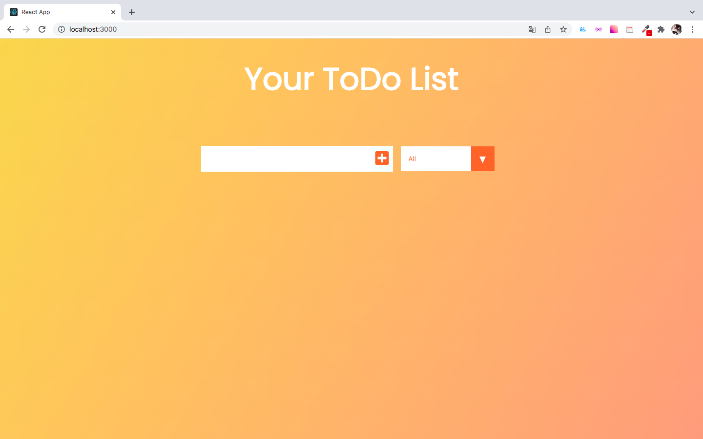
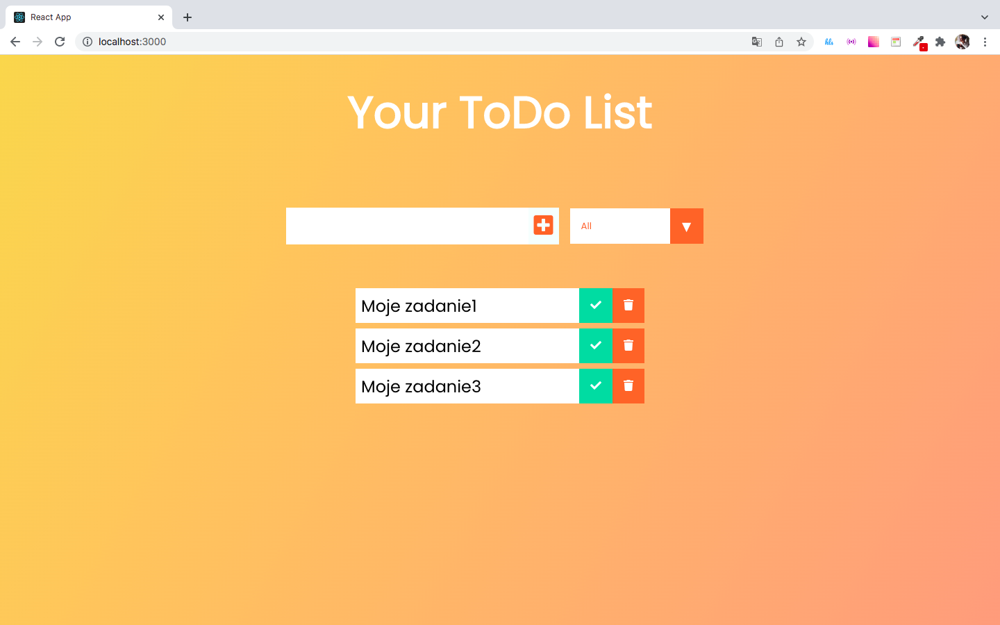
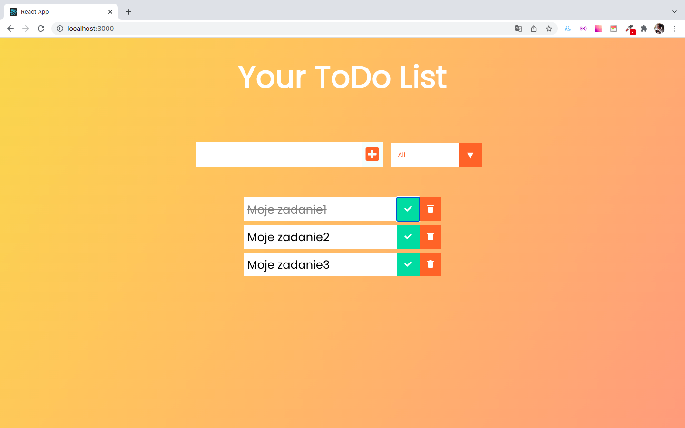

# reactToDoApp
Praca domowa w ramach CodersCamp2021

  
  
  

## Instalacja

Uruchomienie projektu:

Aby uruchomić aplikację, wykonaj następujące kroki:

1. Sklonuj repozytorium.
2. Otwórz repozytorium w edytorze.
3. Zainstaluj zależności za pomocą komendy: npm install.
4. Wystartuj serwer za pomocą komendy: npm start

Aplikacja będzie dostępna pod adresem localhost:3000
